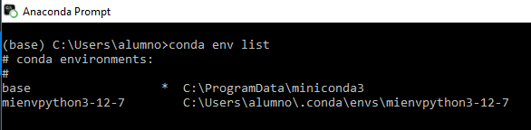
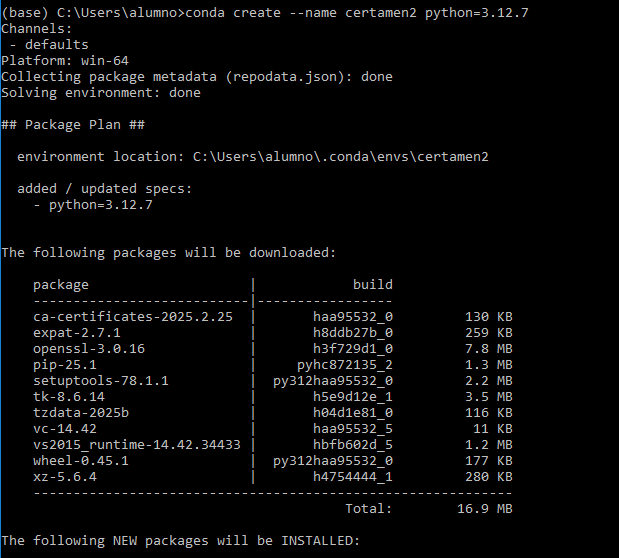
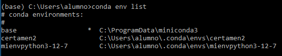
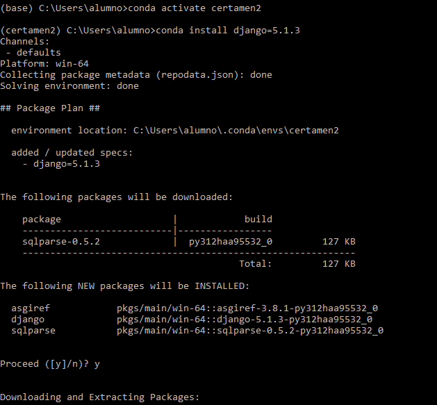
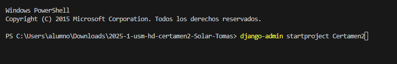
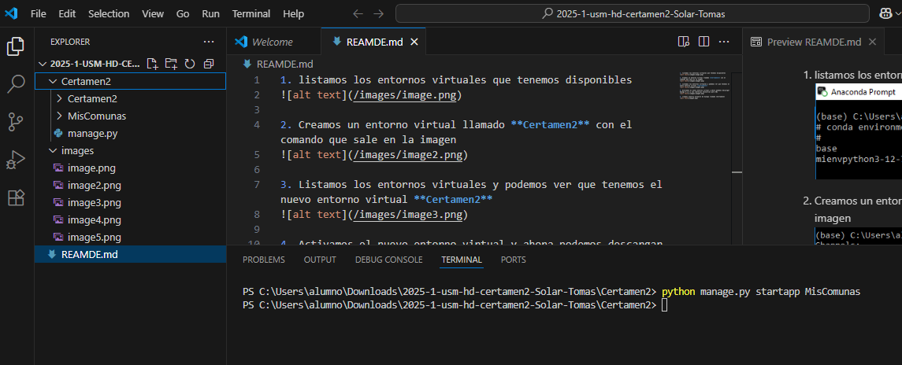

1. listamos los entornos virtuales que tenemos disponibles

2. Creamos un entorno virtual llamado **Certamen2** con el comando que sale en la imagen 

3. Listamos los entornos virtuales y podemos ver que tenemos el nuevo entorno virtual **Certamen2**

4. Activamos el nuevo entorno virtual y ahora podemos descargar Django 5.1.3 y las librerias necesarias para SQL 

5. creamos nuestro proyecto de django llamado **Certamen2**

6. finalmente, creamos la apliación de django llamada **MisComunas**
 

7. y tenemos todo lo necesario para hacer un CRUD funcional con django

